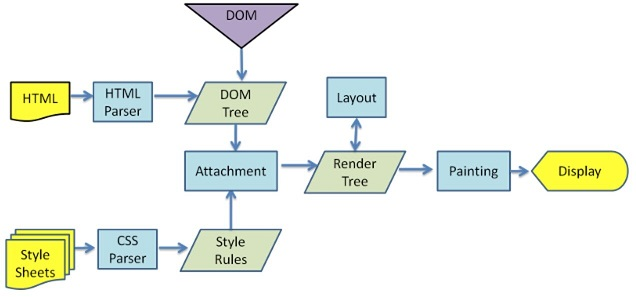
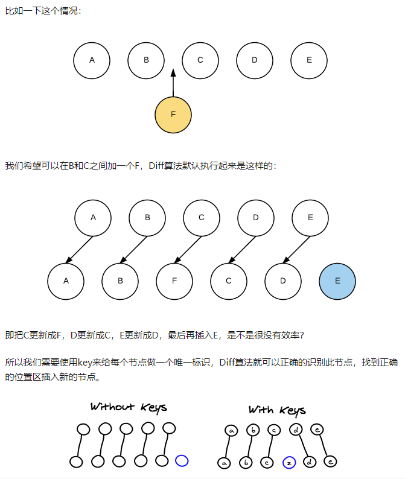
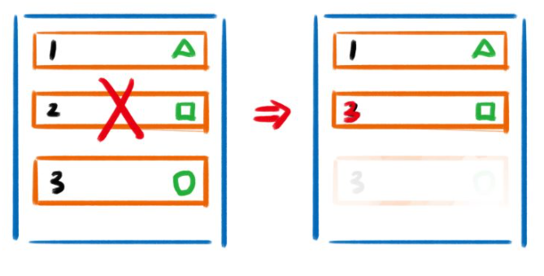

##### 1、虚拟dom

浏览器加载dom流程



1、创建dom tree --- 创建style Rules --- 构建Render tree ---布局layout --- 绘制paiting

构建dom Tree，生成style Rules样式表，将样式表和dom tree合成一颗Render树（此过程称为Attachment），dom节点都有attach方法，接受样式信息，返回一个render对象，render对象构成一颗Render树。有Render树以后，浏览器布局，为每一个Render树上的节点确定在一个显示屏上出现精准坐标值。调节每个节点的paint方法，让节点显示。

传统dom：你有10个dom节点，浏览器会从构建dom树开始从头到尾执行一遍流程。从第一个执行到最后一个。

虚拟Dom：传统dom的一次操作更新10次dom，虚拟Dom不会立即操作dom，而是将这10次更新的diff内容保存到本地的一个js对象中，最终将这个js对象一次性attach到Dom树上。

实现虚拟Dom代码步骤：后续补

diff算法：后续补

##### 2、v-for 里面的key是干嘛的

作用：主要是为了高效的更新虚拟Dom

不加Key,会复用dom且更新Dom属性，从新更新一波

加Key,有了唯一标识，可以准确定位到要插入dom节点的位置



当页面数据变化时，diff算法只会比较同一层级的节点：

节点类型不同，直接干点前面的节点，再创建并插入新的节点，不会再比较这个节点以后的子节点

节点相同：则重新设置该节点的属性，从而实现节点的更新

##### 3、v-for的key使用index的缺点

优点： 性能更好

缺点：会有隐藏Bug

---------------------------------------------------------------------------------------

不设置Key：



设置key非index没问题

设置key为Index: 犹豫index一直都是1，2，3，所以删除一个以后2以后，index又重新变成了1,2

##### 4、中断promise链

方法一：通过抛出一个异常

```javascript
let needBreak = true;
let p = new Promise((resolve, reject) => {
  resolve('step1');
});
p.then(data => {
  console.log(data);
  return 'step2';
}).then(data => {
  console.log(data);
  if (needBreak) {
    throw "we need break";
  }
  return 'step3';
}).then(data => {
  console.log(data);
  return 'step4';
}).catch(reason => {
  console.log('got error:', reason);
}).finally(() => {
  console.log('finished.');
});
```

方法二：通过reject来中断

```javascript
let needBreak = true;
let p = new Promise((resolve, reject) => {
  resolve('step1');
});

p.then(data => {
  console.log(data);
  return 'step2';
}).then(data => {
  console.log(data);
  if (needBreak) {
    return Promise.reject('break without exception.');
  }
  return 'step3';
}).then(data => {
  console.log(data);
  return 'step4';
}).catch(reason => {
  console.log(reason);
}).finally(() => {
  console.log('finished.');
});
```

##### 5、promise怎么处理错误

reject()、catch()、finally()

##### 6、双向数据绑定怎么实现

vue双向数据绑定是通过数据劫持结合发布订阅模式来实现的，也就是说数据和视图同步，数据发生变化，视图跟着变化，视图变化，数据耶随之发生改变。

核心是Object.defineProperty()方法